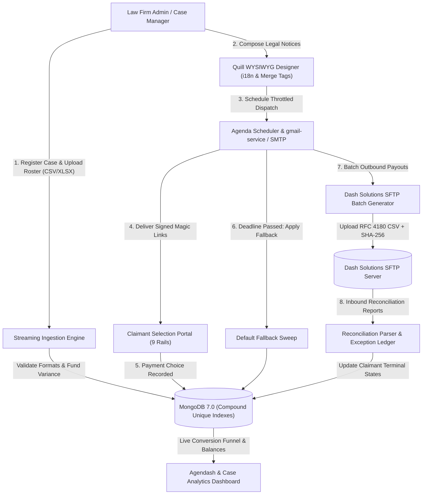

# JurisBanking: Settlement Payment Automation

[](LICENSE)
[]()
[]()
[](docs/TRAINING_VIDEOS.md)
[]()
[]()
[]()


> **Enterprise-grade, mathematically verified class-action settlement administration and legal payment distribution platform built on the MERN stack (MongoDB, Express, React, Node.js) with native Agenda scheduling, Agendash, Quill WYSIWYG, 9 payment rails, multi-language localization, Dash Solutions SFTP automation, and open-source `gmail-service` integration.**

---

## 🏛️ Overview & Purpose

Class-action and legal settlement administration has historically been dominated by legacy service bureaus charging 10%–25% cuts of settlement pools while operating opaque, antiquated systems. 

**JurisBanking** is an open-source settlement distribution engine engineered for law firms, settlement claims administrators, and court-appointed special masters. It provides **tamper-proof transparency, mathematical payment validation, automated batch disbursement over SFTP, and audit reconciliation**.



---

## 📽️ UX Training Videos & Walkthroughs

The repository includes high-definition training video walkthroughs and full user documentation located in [`docs/TRAINING_VIDEOS.md`](docs/TRAINING_VIDEOS.md):

| Flow | Video Title | Walkthrough Scope | Duration |
| :---: | :--- | :--- | :---: |
| **01** | **[Case Setup & Roster Ingestion](docs/videos/01_case_setup_and_roster_ingestion.mp4)** | Matter parameters, $1.25M fund pool, CSV streaming upload & preview modal | `00:20` |
| **02** | **[Quill WYSIWYG & Localization](docs/videos/02_quill_wysiwyg_and_localization.mp4)** | Legal notices, merge tags, and multi-lingual switching (EN, ES, ZH, VI) | `00:10` |
| **03** | **[Claimant Portal & 9 Payment Rails](docs/videos/03_claimant_portal_and_payment_rails.mp4)** | Secure 64-hex token, ABA validation, 9 payment rails, electronic signature | `00:39` |
| **04** | **[Analytics & Agendash](docs/videos/04_analytics_dashboard_and_agendash.mp4)** | Real-time delivery funnel, payout charts, NACHA exceptions & Agenda jobs | `00:21` |

---

## ✨ Key Capabilities

### 1. Role-Based Access Control (RBAC) IDM
- Fail-closed permission hierarchy: `super_admin`, `platform_admin`, `law_firm_admin`, `case_manager`, `auditor`, and passwordless single-claim `claimant`.
- Secure JWT issued in `HttpOnly`, `SameSite=Strict` cookies with sliding-window refresh token rotation.
- Composite IP + account sliding-window rate limiters guarding against brute-force attacks.

### 2. Two-Phase Streaming Ingestion Engine
- Streaming parsers for both CSV (`fast-csv`) and Excel (`xlsx`).
- Two-phase staged preview: validates formatting errors, malformed emails, and in-file duplicate claim IDs before database commits.
- Fund variance limit: blocks commits if total claimant allocations exceed the court-approved settlement fund pool.
- Compound database index `{ caseId: 1, claimId: 1 }` prevents concurrent double-uploads.

### 3. Localized Quill WYSIWYG Template Designer
- Rich text email notice and public landing page designer.
- Dynamic merge tags: `{{claimant_first_name}}`, `{{claimant_last_name}}`, `{{settlement_amount}}`, `{{case_name}}`, `{{selection_deadline}}`, `{{payment_selection_link}}`.
- Multi-language localization (`en`, `es`, `zh`, `vi`) with instant language switching tabs.
- Pre-substitutive HTML escaping (`sanitize-html`) neutralizing stored XSS, script vectors, and SVG onload triggers.

### 4. Claimant Selection Portal & 9 Payment Rails
- Responsive, mobile-first, WCAG 2.1 AA accessible claimant selection portal (`/claim/:token`).
- 64-hex cryptographically signed magic links with AES-256-GCM encrypted tokens.
- Supported Payment Rails:
  1. **Direct Deposit (ACH)**: Federal Reserve Modulo-10 routing transit number check digit verification.
  2. **Push to Debit Card**: Luhn algorithm check digit verification and card tokenization.
  3. **Digital Virtual Card**: Instant Visa/Mastercard digital prepaid token delivery via Dash Solutions.
  4. **Physical Mailed Check**: USPS address format verification (court-ordered fallback method).
  5. **PayPal**: Validated recipient PayPal email or mobile phone.
  6. **Venmo**: Validated recipient `@username` handle or phone number.
  7. **Zelle**: Enrolled US mobile phone number or email address.
  8. **Bitcoin (BTC)**: Valid on-chain wallet address verification supporting Legacy Base58Check (P2PKH/P2SH), Native SegWit Bech32 (`bc1q`), and Taproot Bech32m (`bc1p`).
  9. **Court Fallback**: Automatic default assignment for non-responsive claimants upon deadline expiry.
- Re-election lock: Prevents modification once a claimant's payment is batched or queued for SFTP.

### 5. Dash Solutions SFTP Automation & Inbound Reconciliation
- Generates standardized RFC 4180 banking interchange disbursement batches (Header, ACH, Card, Debit, Check, Trailer) with control totals and companion `.sha256` checksums.
- Secure SFTP client (`ssh2-sftp-client`) supporting atomic `.tmp` staging and rename.
- Inbound status report parser (`REPORT_STATUS_*.csv`) mapping NACHA return codes (`R01`–`R85`), updating claimant terminal statuses (`paid`, `rejected`, `returned`), and logging structured audit records.
- Administrative exception resolution workflows (`switch_to_check`, `resend_email`, `requeue_sftp`, `mark_resolved`).

### 6. Agenda Scheduler & Authenticated Agendash
- Native MongoDB 7.0 persistence (zero Redis dependencies).
- 6 automated background jobs: notification dispatch, deadline reminders (7 days and 48 hours), deadline fallback sweep, outbound SFTP batch generation, inbound SFTP report polling, and Gmail bounce scanning.
- Authenticated Agendash dashboard mounted at `/agendash` with dual-mode content negotiation (HTML UI and JSON API).

### 7. Open-Source `gmail-service` Integration
- Dedicated client adapter ([`server/src/services/gmailService.ts`](file:///home/robert/projects/juris-banking-settlement-payment-automation/server/src/services/gmailService.ts)) connecting to the open-source `gmail-service` REST API (`http://localhost:8085`).
- Enables law firms to dispatch legal notices directly from their Google Workspace accounts.
- Pre-flight bounce suppression (`GET /api/gmail/bounces/check`) and background bounce detection scans (`POST /api/gmail/bounces/scan`).

### 8. Analytics & Formula-Injection Neutralized CSV Exports
- Real-time case delivery funnels: Uploaded $\to$ Dispatched $\to$ Delivered $\to$ Visited $\to$ Selected $\to$ Disbursed.
- Interactive Recharts visualization of payment rail distribution and fund balances.
- Streaming audit log export with formula injection defense (CWE-1236, neutralizing `=+-@\t\r` formula triggers).

---

## 🏗️ Repository Architecture

```
juris-banking-settlement-payment-automation/
├── server/                    # Express + Node.js + Mongoose + Agenda backend
│   ├── src/
│   │   ├── config/            # Database and scheduler configuration
│   │   ├── controllers/       # Case, Ingestion, Portal, Auth, Analytics controllers
│   │   ├── middleware/        # RBAC, Rate Limiter, and JWT middleware
│   │   ├── models/            # Case, Claimant (compound indexed), User schemas
│   │   ├── routes/            # Express routes and /agendash mount
│   │   ├── services/          # Dash SFTP, Agenda, Ingestion, Template, Gmail adapters
│   │   └── utils/             # Modulo-10, Luhn, Bitcoin regex validators
│   └── tests/                 # 41 Vitest test suites (545 tests)
├── client/                    # React 19 + Vite + TypeScript frontend
│   └── src/
│       ├── components/        # QuillTemplateEditor, LanguageSwitcher, PreviewModal
│       ├── views/             # CaseAdmin, ClaimantPortal, AnalyticsDashboard
│       └── i18n/              # Localized strings (en, es, zh, vi)
├── fixtures/mock-sftp/        # Built-in ssh2 mock SFTP daemon for Dash testing
├── storage/                   # Spooling directories for SFTP and emails
├── docs/                      # User training guides, video workflows, and media assets
└── tests/e2e/                 # 84-test master end-to-end acceptance runner
```

---

## ⚡ Quickstart (Native Host Installation)

JurisBanking is designed to run natively on Linux user-space without Docker containers.

### Prerequisites
- **Node.js**: v20.x or v22.x LTS
- **MongoDB**: v7.0+ running natively on `localhost:27017`

### 1. Clone & Install Dependencies
```bash
git clone https://github.com/your-org/juris-banking-settlement-payment-automation.git
cd juris-banking-settlement-payment-automation

# Install all monorepo dependencies
npm install
cd server && npm install
cd ../client && npm install
cd ..
```

### 2. Configure Environment
```bash
cp .env.example .env
# Review and adjust secrets, port, or email settings in .env
```

### 3. Start MongoDB Native Service
```bash
sudo systemctl start mongod
```

### 4. Run Development Servers
In separate terminal tabs:

```bash
# Terminal 1: Start Backend API & Agenda Scheduler (Port 5000)
cd server
npm run dev

# Terminal 2: Start React Frontend (Port 5173)
cd client
npm run dev

# Terminal 3 (Optional): Start Local Mock SFTP Server for Dash testing (Port 2222)
node fixtures/mock-sftp/server.js
```

Access the applications:
- **Admin Dashboard**: `http://localhost:5173`
- **Agendash Scheduler**: `http://localhost:5000/agendash`
- **Claimant Portal**: `http://localhost:5173/claim/:token`

---

## 🧪 Testing & Verification

The codebase includes 100% deterministic test coverage across all layers:

### Run Backend Unit & Integration Tests (545 Tests)
```bash
cd server
npm test
```
*Executes 41 test files in single-fork isolation with dynamic per-suite MongoDB namespaces.*

### Run Master End-to-End Acceptance Tests (84 Tests)
```bash
npm run test:e2e
```
*Executes all 4 tiers: Feature Coverage, Boundary Cases, Pairwise Cycles, and a simulated 1,000-Claimant Class Action Settlement Lifecycle.*

### Compile Production Builds
```bash
npm run build
```
*Builds both server TypeScript and client Vite assets with zero compilation errors.*

---

## 🛡️ Security Invariants

1. **Zero Hardcoded Secrets**: All credentials, keys, and tokens are read exclusively from environment variables.
2. **Formula Injection Neutralization (CWE-1236)**: All user-controlled fields in CSV exports are sanitized by prefixing formula triggers (`=`, `+`, `-`, `@`, `\t`, `\r`) with a single quote (`'`).
3. **Mathematical Validation Oracles**:
   - ABA Routing Numbers: `(3(d1 + d4 + d7) + 7(d2 + d5 + d8) + (d3 + d6 + d9)) mod 10 = 0`
   - Debit Cards: Full Luhn algorithm validation (rejects single-digit errors and transpositions).
   - Bitcoin Addresses: Base58Check checksum validation and Bech32/Bech32m prefix and length validation.
4. **Pre-Substitutive HTML Escaping**: Template merge tags are HTML-escaped *prior* to substitution to prevent injection reflection.
5. **Atomic Disbursement Drawing**: Batches atomically mark claimant records as `batched` via `updateMany` to eliminate concurrent double-draw race conditions.

---

## 📄 License & Mandatory Commercial Licensing Agreement

This software is released under the **JurisBanking Commercial Source-Available License (Version 1.0)** — see the [`LICENSE`](LICENSE) file for complete legal terms.

### 🔑 Commercial Terms Summary:
1. **Mandatory Paid Commercial License**: Any use of this software to administer legal settlements, process live disbursements, charge client fees, generate revenue, or operate a commercial service **strictly requires an executed Paid Commercial License Agreement with Robert Baindourov**. Unlicensed commercial deployment constitutes willful copyright infringement.
2. **Free Non-Commercial Evaluation**: You are free to view, inspect, download, and test the codebase privately for personal evaluation, academic research, and non-commercial development.
3. **Permanence (Zero Conversion)**: This license is perpetual. It does **not** contain a change date or sunset clause, and will **never** automatically convert into an open-source, MIT, or copyleft license. Robert Baindourov retains full, exclusive commercial rights permanently.
4. **Mandatory Attribution**: All authorized deployments must conspicuously display `"Powered by JurisBanking — Created by Robert Baindourov"`.

### 💼 Inquiries & Commercial Licensing:
To execute a commercial license agreement, arrange per-settlement disbursement royalty terms, or request enterprise support:
- **Licensor**: Robert Baindourov
- **Email**: `rbaindourov@gmail.com`

---

## 🤝 Community & Governance

- [Contributing Guidelines](CONTRIBUTING.md)
- [Security Policy](SECURITY.md)
- [Code of Conduct](CODE_OF_CONDUCT.md)
